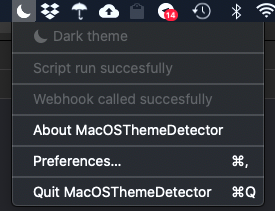
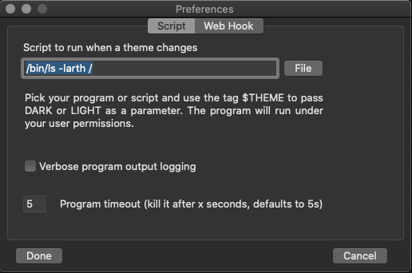
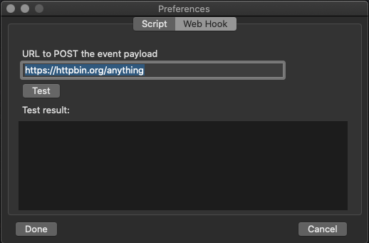

### MacOS Theme Detector

Status bar (Agent) app for reacting to a theme change (Dark to Light and vice-versa).

The status bar icon will change to match DARK (moon) and LIGHT (sun) theme.

On theme change it can run a custom script

 

or call a webhook

#### Build

You will need cocoapods installed and running:

$ pod install

After that open MacOSThemeDetector.xcworkspace in XCode and hack away.

#### Pre-built binaries

Pre built binaries are loaded into the releases page. 
Just ownload and unzip them.

